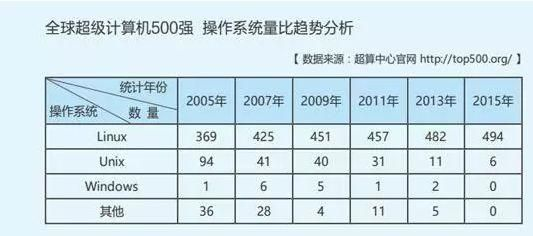

### 什么是Linux

Linux 通常被认为是一套操作系统，实际上它是一系列Linux内核基础上开发的操作系统的总称。

### Linux 怎么读

对于Linux这个英文单词，中国人的发音各式各样，有的读作[ˈlɪnɪks]（”李尼克斯“），有的读作[ˈlinju:ks]（“李纽克斯”），有的读作[ˈlɪnəks]（“李呢克斯”）。官方给出的标准发音为['li:nэks]，写成中文就是“李呢克斯”。

其实我见过很多人，有很多不同的读法，其实不用过度纠结读音问题。

### Linux 的由来

要说Linux必须先说说Unix, Linux诞生之前，先有的Unix，因为Unix并非免费开源的，用必须买授权之类的，很少人承担的起。

在1983年，理查德·斯托曼创建了一个自由软件，类Unix，与POSIX兼容的操作系统为目标的GNU计划。作为这个计划其中的一部分，他又写了GNU通用公共许可证（GPL）。

GNU计划发起后，有很多支持者，所以在这期间产生了许多非常棒的软件，但遗憾的是，一直没有一个比较完美的操作系统出现。直到1991年，芬兰大学生林纳斯•本纳第克特•托瓦兹（Linus Benedict Torvalds）基于兴趣开发了一个类Unix操作系统，一经发布便得到了广大爱好者的追捧，这个系统就是Linux。 

###  名称的由来

Linus Torvalds本要把他的发时叫做Freax——“fread”，“free”和“x”（暗指Unix）的合成词。在开发系统的前半年里，他把文件以文件名“Freax”存储。Torvalds考虑过Linux这个名字，但是因为觉得它过于自我本位而放弃了使用它。

为便于开发，在1991年9月，他把那些文件上传到了赫尔辛基工业大学（HUT）的FTP服务器（ftp.funet.fi)。Torvalds在HUT负责管理那个服务器的同事Ari Lemmke，觉得“Freax”这个名字不是很好，就在不咨询Torvalds的情况下，把项目的名字改成了“Linux”。但是之后，Torvalds也同意“Linux”这个名字了：“经过多次讨论，他承认Linux这个名字更好。在0.01版本Linux的源代码的makefile里仍然使用‘Freax'这个名字，在之后‘Linux'这个名字才被使用。所以，Linux这个名字并不是预先想好的，只是它被广泛接受了而已

### Linux吉祥物

1996年，Torvalds为Linux选定了企鹅作为它的吉祥物，这就是很多时候看Linux相关书籍的时候，会有个企鹅的原因了

### Linux能用来干嘛

其实你在不知道Linux是什么东西的时候，你身边已经有了它的身影，比如路由器系统，你在网上刷短视频或者淘宝买东西的时候，都离不开Linux服务器的支持，安卓手机的系统安卓也是从Linux内核的基础上开发出来的

以下为网上找的Linux 占比的一个趋势，感受下

 

以上就是对Linux概念的简介。温故而知新，我最近打算开始将Linux基本指令开始重新梳理一下，如果你也想跟我一块儿回顾下，别忘了关注下，咱们一起回忆，一起进步。
