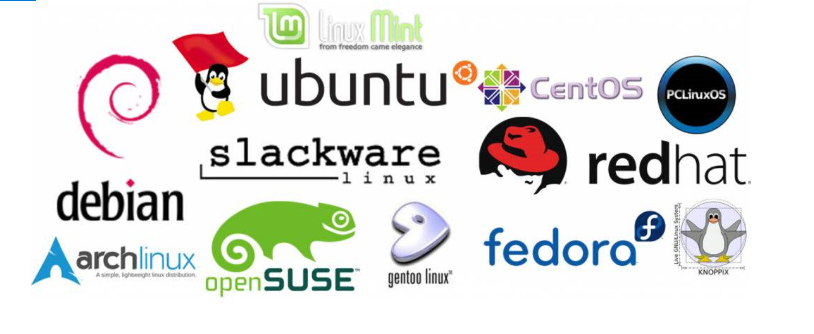
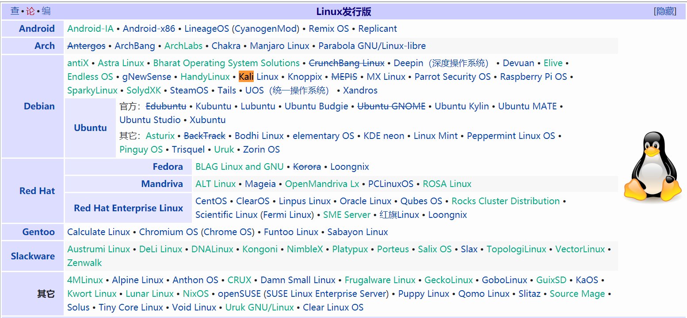

### 前言

作为一个Linux开发者，你是否被面试考官或者直接领导问过同样的问题，那就是“你用的Linux版本是多少”，因为开发人员有时候多关心的是业务相关逻辑，往往忽略了这些问题，造成面试者或者领导认为你的能力不行，为了解决这个问题，我带大家简要的了解下Linux内核相关概念

### Linux内核版本号

第一种方式：

Linux 的版本号分为两部分，即内核版本以及发行版本。内核版本号由三个数字组成A.B.C

| A:内核主版本号   | 有重大改变才会变               |
| ---------------- | ------------------------------ |
| B:内核次版本号   | 偶数代表稳定版；奇数代表开发版 |
| C:内核修订版本号 | 轻微修改，安全补丁；bug修复等  |

第二种方式：
major.minor.patch-build.desc

```
major : 主版本号，有结构变化才变更 
minor : 次版本号，新增功能时才发生变化，一般奇数表示测试版，偶数表示生产版 
patch : 补丁包数或次版本的修改次数 
build : 编译（或构建）的次数，每次编译可能对少量程序做优化或修改，但一般没有大的（可控的）功能变化。
desc  : 当前版本的特殊信息，其信息由编译时指定，具有较大的随意性，有如下的标识是常用的： 
    rc（或r），表示发行候选版本（release candidate），rc后的数字表示该正式版本的第几个候选版本，多数情况下，各候选版本之间数字越大越接近正式版。
    smp，表示对称多处理器（Symmetric MultiProcessing）。
    pp，在Red Hat Linux中常用来表示测试版本（pre-patch）。
    EL，在Red Hat Linux中用来表示企业版Linux（Enterprise Linux）。
    mm，表示专门用来测试新的技术或新功能的版本。
    fc，在Red Hat Linux中表示Fedora Core。 
```


### 如何查看内核版本号

查看内核版本有多种办法最常用的指令

##### 1、uname -a

```
[root@bogon ~]# uname -a
Linux bogon 3.10.0-514.el7.x86_64 #1 SMP Tue Nov 22 16:42:41 UTC 2016 x86_64 x86_64 x86_64 GNU/Linux
[root@bogon ~]# uname -r
3.10.0-514.el7.x86_64
```

##### 2、cat /proc/version

```
[root@bogon ~]# cat /proc/version 
Linux version 3.10.0-514.el7.x86_64 (builder@kbuilder.dev.centos.org) (gcc version 4.8.5 20150623 (Red Hat 4.8.5-11) (GCC) ) #1 SMP Tue Nov 22 16:42:41 UTC 2016
```

说明如下：

 版本号3.10.0-514.el7.x86_64

| 3      | 主版本号                            |
| ------ | ----------------------------------- |
| 10     | 此版本号，当前为稳定版本            |
| 0      | 修订版本号                          |
| 514    | 表示发行版本的补丁版本              |
| el7    | 内核为RedHat或Centos 发行版专用内核 |
| x86_64 | 表示采用的是84位的cpu               |

### Linux发行版本

发行版本区别于内核版本，属于Linux内核+GUN工具和库等等，不同的发行版本的安装软件的打包方式不同，给人最直接的感觉就是默认安装软件包的时候，Centos用的是rpm 或 yum , 而 Ubuntu 用的是apt-get 或apt

#### 基于Dpkg (Debian系)

其中最为人知的，是基于Debian的桌面版（Ubuntu）

Debian 完全靠社区维护，其特点是：非常强调"自由"的开源理念。它有很多衍生的发行版（比如 Ubuntu），形成一个大家族。在 Linux 的众多家族中，Debian 家族是软件包最多的

#### 基于RPM (Red Hat系)

其中最为人知的，是基于RPM的Centos 

Centos基于RedHat发展而来，由于Redhat的源代码是公开的，所以CentOS项目的人拿来自己再编译，同样的代码，同样的编译器，编译出来的自然是同样的东西。只不过里面删除了Redhat的Logo以及相应信息，而核心的管理工具还是rpm，只是用一个免费的软件包管理器yum（yellow dog update manager）替代了Redhat中的up2date，up2date更新是连接到Redhat的收费服务站点的，通过钱买来的服务代码通过认证。

#### 其它

因为Linux的发行版本太多了，可以根据下面的图做更多的了解




以上就是对Linux版本的概念的一些总结，如果以后再有人问你Linux版本相关的内容，是不是心里更有底了。

温故而知新，我最近正在整理Linux一些基础知识，如果感兴趣，别忘了关注下。
