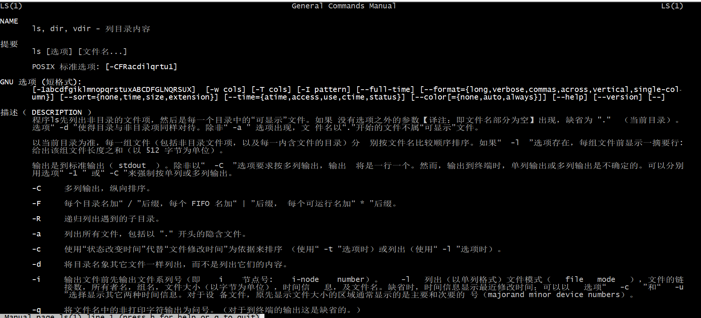

ls 是接触Linux系统，大家基本都会用到的指令，今天带大家回忆下ls的基本用法

### ls基础用法

##### 作用

ls 指令的作用为 列出目录内容

##### 用法

```
ls [选项] [文件名...]
```


#### 查看多个文件或文件夹

```shell
ls  /dev/ /boot
```


#### 查看文件详细信息

ls -l 如果不添加参数，默认指的是查看当前所在目录下内容

```shell
ls -l 
```


| -rw-r--r--    | 文件的类型和权限  |
| ------------- | ----------------- |
| 1             | 硬链接数          |
| root root     | 所属用户 和用户组 |
| 0             | 大小              |
| 7月   7 23:17 | 最后修改时间      |
| myfile.txt    | 文件名称          |

#### 查看隐藏文件或隐藏文件夹

大家都知道，在windows下，隐藏文件和隐藏文件夹都是通过系统去设置的，但是在Linux系统下，隐藏文件就相对简单，只要在文件或文件夹命名时，以点开头，如下图例子中的“.abc” 默认ls 的时候是不显示的

```shell
ls -a
```


ls -a  后，可以看到多了三个文件

| .    | 当前目录（每个文件夹中都有） |
| ---- | ---------------------------- |
| ..   | 上级目录（每个文件夹中都有） |
| .abc | 自己设置的隐藏文件           |

 因为所有的文件中都有 . 和 ..两个文件夹，如果想查看的时候想忽略他们，可以用 ls -A 指令来忽略这两个文件夹

```
ls -A
```


### 给文件排序展示

##### 默认排序展示

 默认ls 查看文件的时候，是以文件名称进行排序的


##### 逆向排序展示指令

```
ls -r 
```


由上面两次执行的结果对比可以看出，ls -r 的文件排序与ls 执行结果的差别，根据文件名称显示的顺序发生了变化

[^注意]: ls -lr  与 ls -l -r 是命令行参数的两种不同的用法，作用是一样的，为了简单，经常会用 ls -lr 这样的方式，和顺序也没有关系 如 ls -rl 和 ls -lr 都一样

##### 按时间排序展示

按照最新更新的文件在前进行排序

```
ls -t
```


##### 按时间逆向排序展示

按照最新更新的文件在前逆向排序

```
ls -rt
```


##### 按文件大小排序

按照大文件在前排序

```
ls -S
```


##### 按文件大小逆向排序

小文件在前

```
ls -Sr
```


#### 递归地列出子目录的内容

有时候需要查看所有文件的内容，这时候下面的指令就派上用场了，它将会把所有文件夹中的内容都展示出来

```shell
ls -R
```


#### 友好的显示文件大小

通常和-l 一块儿进行使用，这样显示出来的文件大小更易读，在下图中可以看出两者的区别

```
ls -lh
```


以上是ls 在日常生活中常用的一些用法，可以满足日常使用中的基本需求，如果想了解更多 可以执行 man  ls，里面有更多参数的用法。


如果文章对你有所帮助，不妨点下关注，支持下，谢谢。