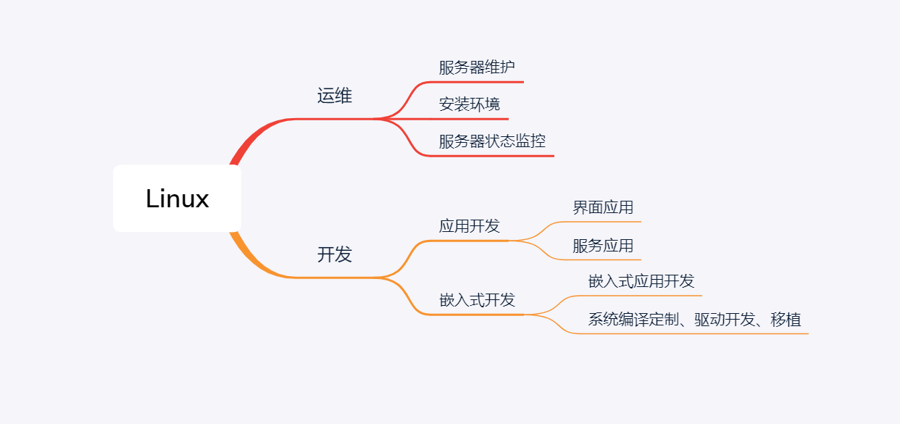

#### 前言：

经常有人问我，怎样学习Linux呢？我想快速入门，给我推荐一些好的课程吧，正好五一休息几天，我看完就入门Linux了，我现在工作中经常会用到Linux服务器，每次遇到都会遇到各种各样的问题，但是在你心里怎么算入门Linux呢？我们今天共同探讨下这个问题

### 怎么算入门Linux

其实这个问题有点儿大，在咱们日常生活中，大家肯定都用过windows吧，那怎么算入门windows呢？

#### 摆正心态

回忆一下我们小时候学习windows的过程吧，我记得我学习windows的时候，首先学习的是开机和关机，然后学习的鼠标什么是单击、什么是双击，如何打开文件，新建文件，如何创建快捷方式，然后就是艺术字，office，发邮件等等，那么Linux为什么就不能像小学生时代那样的心态是学习呢？

其实熟悉是有一个过程的，像交朋友一样的心态对待学习Linux这件事情吧，你对Linux接触的的越多，你会慢慢的喜欢上它的。

#### 认清方向

其实Linux的学习方向也有很多，其实你想做的可能只是能熟练的在Linux安装一些服务，或者Linux服务器遇到问题，你能知道是什么原因而已。下面我总结了一下我认知中的Linux的一些方向，可能不见得权威，希望对你的学习方向有一定的指导性作用

其实主要分为运维和开发

##### 运维

顾名思义，运维的主要工作是对Linux服务器的一些维护工作，搭建一些运行服务，保证服务器正常运行，熟悉一些常用服务的配置，对服务器进行监控，对数据进行备份，对服务进行升级等等

##### 开发

开发主要是指的在Linux服务器上进行软件开发，类比windows开发差不多，其实就是开发的软件或服务在Linux服务器上运行，实现自己想要的目的。

嵌入式开发区别于应用开发，主要是嵌入式开发是对硬件的一些支持，嵌入式软件一般用于小的基于Linux系统的智能硬件上，因为智能硬件资源更小，需要对Linux内核进行裁剪，去除不需要的功能模块，或添加特殊的功能模块等等

### 开始学习

根据上面讲到的，你如果认清了方向，那么你就可以开始学习了

首先像学习windows一样，先安装一个Linux 桌面版，ubuntu 或Centos都可以（怎么安装请自行搜索，这里不做详细介绍），安装登陆后，先像学习windows软件一样，熟悉下用鼠标进行文件操作，开关机，网络配置等等，用鼠标时，是不是感觉，这不就是界面怪异一些的windows系统吗？心里障碍是不是瞬间就没有了，这对于学习是一个很好的事情。

当你克服对未知事物的恐惧后，后面就开始学习命令行了，因为命令行才是Linux最常用的操作方式。

##### 入门Linux需要学习的基础知识

Linux 系统的搭建、常用指令，常用工具服务的安装和使用，文件目录结构，权限等等。

以上这些，我在后面会慢慢的进行总结。

### 总结

像交个朋友一样的心态学习Linux,你越熟悉它，你就会越了解它。

克服心里障碍很重要，其实Linux没有那么恐怖，对比着学习windows的心态去学习Linux,你会发现，原来学习Linux如此简单。

认清自己想要学习的方向，是运维还是开发，根据不同的方向针对性的进行学习，对你的帮助更大。

这篇文章，主要是前阵子有人问我如何快速的入门Linux一些个人想法，希望对你有所帮助。

最后，别忘了关注，下期更精彩。

 

